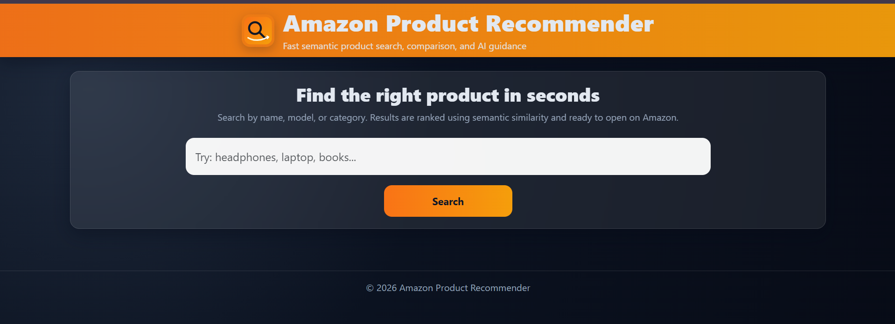
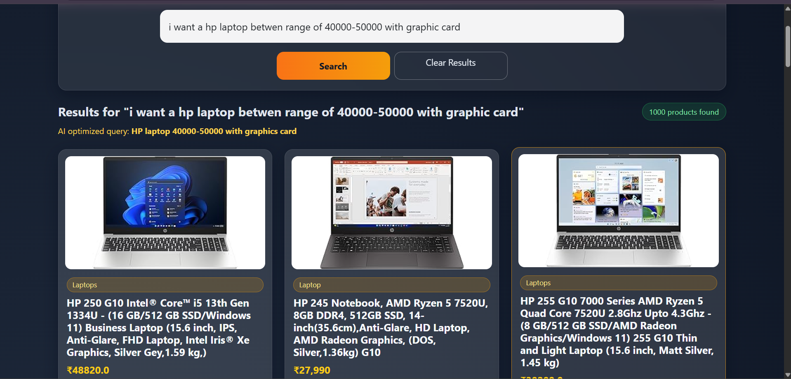
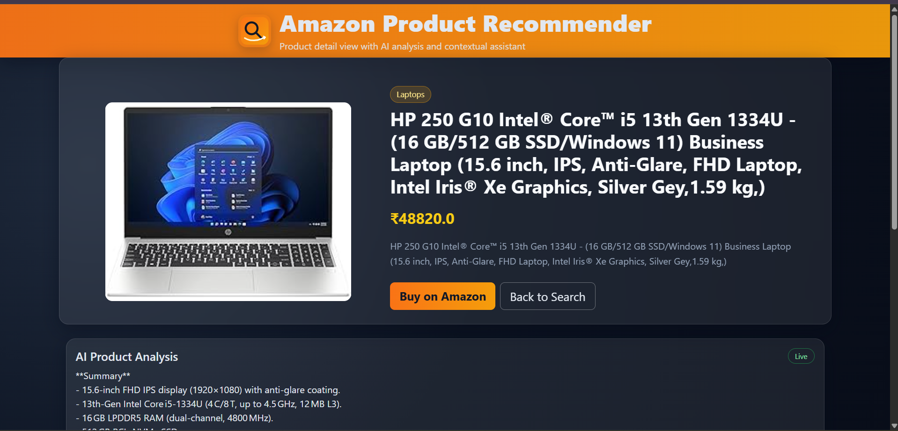
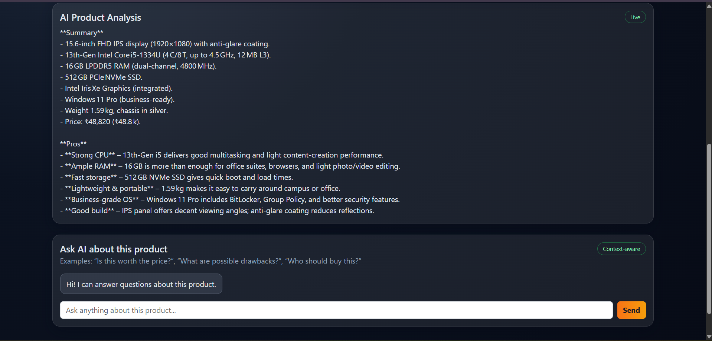
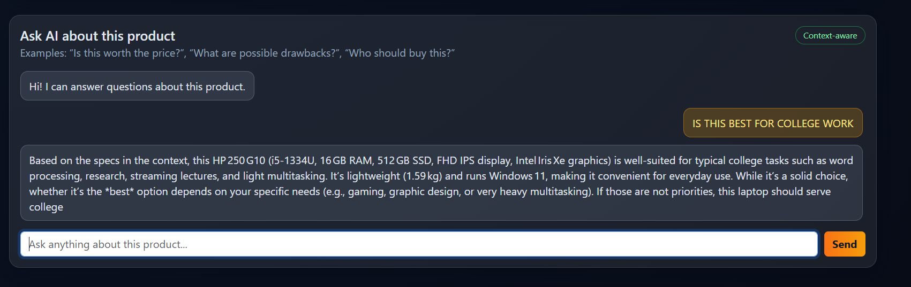

# 🛍️ Amazon-Like Semantic E‑Commerce Recommender System

## 📘 Project Overview
A full‑stack **AI‑powered e‑commerce search and recommendation engine** inspired by Amazon 🧠.

It scrapes real product data using Selenium & BeautifulSoup, builds a **semantic understanding model** (using Sentence‑BERT), and serves intelligent product recommendations through a Flask backend and a Bootstrap‑based frontend that visually resembles Amazon.

---

## 🚀 Features
- **Web Scraping:** Automated product extraction from Amazon using Selenium + BeautifulSoup.
- **Data Engineering:** Cleaned & merged all category‑wise CSVs into a single master dataset.
- **Semantic Search:** Deep learning via SentenceTransformer for intelligent text–product matching.
- **Smart Ranking:** Cosine similarity to find contextually closest products.
- **Frontend Design:** HTML + CSS + Bootstrap for a clean, Amazon‑style interface.
- **Flask Backend:** REST‑based architecture to serve real‑time search results.
- **Modular Design:** Two‑script architecture for ease of debugging and updates.

---

## 🧠 Model & Training

### Model Used
`SentenceTransformer` → **all‑MiniLM‑L6‑v2**

### Why This Model?
- Compact and fast transformer model by HuggingFace.
- Learns semantic meaning — “phones under 50000” ≈ “mobiles below 50k.”
- Built for sentence similarity and recommendation tasks.

### Algorithm Used
**Cosine Similarity** for ranking embeddings:
\[
\text{similarity}(A,B) = \frac{A \cdot B}{||A|| \times ||B||}
\]

### Model Workflow
1. Each product title → vector embedding (1024‑dimensional numeric representation).
2. User query → encoded using the same model.
3. Cosine similarity calculated between query and all products.
4. Products sorted by relevance score.
5. Flask backend returns top K matching products to the frontend.

---

## 💻 Tech Stack

| Layer | Tools Used |
|--------|-------------|
| Web Scraping | Selenium, BeautifulSoup |
| Data Cleaning | pandas, NumPy |
| ML/NLP | SentenceTransformers, Scikit‑learn, RapidFuzz |
| Backend | Flask |
| Frontend | HTML, CSS, Bootstrap |
| Deployment | Render / PythonAnywhere (Free Tier) |

---

## ⚙️ How To Run the Project

### 1️⃣ Clone the Repository
git clone https://github.com/AfzalSurti/AmazonRecommender
cd Amazon-Web-Scrapper

### 2️⃣ Install Dependencies
pip install -r requirements.txt

Amazon_Recommender/
│
├── data/
│   ├── raw/                  # CSVs scraped from Amazon (e.g., laptops_products.csv)
│   ├── processed/            # Cleaned & merged CSVs stored here
│
├── models/
│   ├── tfidf_model.pkl       # TF-IDF model file
│   ├── cosine_sim.npy        # Similarity matrix
│
├── scripts/
│   ├── 1_data_preprocessing.py
│   ├── 2_train_model.py
│   ├── 3_test_recommender.py
│
├── scrapping/
|   ├── scrapping_all_products.py
|
├── results/
│   ├── recommendations.csv   # Output examples of the model
│
├── templates/                # Frontend
│   ├──index.html
|   ├──product.html
|
├──app_symentic.py - main backend logic
├── requirements.txt          # Project dependencies
├── README.md                 # Documentation

data- it has two folders 
      1-raw - a raw datsets that is a amazon data categories wise that i   genrate using the selenium , bs4 .
      2-processed -  then i merged it all raw datasets which are categorie wise

models- I take  a model "all-MiniLM-L6-v2" and train on that products_master.csv dataset
        and compute embeddings and save artifacts in a models/.

results - after training i have to check model is working or not so 
          i run 3_test_recommender_symentic.py and it genrates the output in a results/recommendatios.csv.

scapping - in a scraping theres a script scrapping_all_products.py its a script to 
            get product from amazon site categori wise.

scripts - in a scripts folder there are 3 scripts one for merging , one for training , 
          one for testing  , and one script is for adding categori column in a master datset.

templates - contains frontend file index.html - home page and product.html - product 
            display page .

app_symentic.py - main backend logic is there using flask first load the model 
                  and interprets the input and give corrosponding output and also routings are there.

Procfile - i have to deploye this on render so server sould know which commands to run so 
            i put that command in it.

### 4️⃣ Run Flask App
python app_symentic.py

Your app will now run on:
[http://127.0.0.1:5000](http://127.0.0.1:5000)

---

## 🔧 Important Notes
- Install **Flask** and **transformers** only — other dependencies will auto‑install.
- Run those **two core scripts** separately:  
  - The data/model preparation script  
  - The main Flask file `app_symentic.py`
- Avoid running the merger file directly (due to GitHub file size restrictions).
- After setup, only one command is needed for execution: python app_symentic.py

---

## 🏗️ Future Enhancements
- Add sub‑categories like:
- Mobiles → iPhones, Samsung, Realme
- Clothing → Men‑T‑Shirts, Women‑Tops
- Integrate Flipkart, Meesho, and Myntra scrapers for cross‑platform results.
- Build advanced query understanding with NER or fine‑tuned T5.
- Add online deployment with persistent DB.

---

## 📄 Dependencies
Read  `requirements.txt` 

---

## 🖼️ Project Screenshots

### 1) Home Page

This screen shows the landing page with the search bar and quick product search flow.

### 2) Search Results

This screen displays semantic search results, product cards, pricing, and pagination.

### 3) Product Details

This screen shows detailed product information with direct Amazon redirect and context data.

### 4) AI Product Analysis

This screen highlights AI-generated product analysis with summary, pros, and buying guidance.

### 5) Contextual Chat

This screen demonstrates context-aware chat where users can ask follow-up product questions.

---

## 🧠 What You’ll Learn
- How modern e‑commerce recommendation systems understand intent.
- How to apply transformer models for semantic understanding.
- Building scalable full‑stack AI products with Flask.

---

## ✨ Author
Developed by **Afzal Nasirbhai Surti**

LinkedIn:  https://www.linkedin.com/in/afzal-surti-9904b2287/
GitHub: https://github.com/AfzalSurti

---

🛒 *A real‑world AI + Web Development project made to demonstrate hands‑on NLP for product recommendation.*

